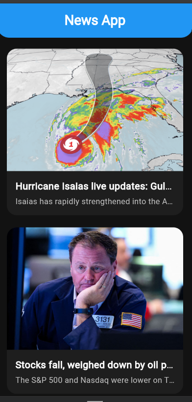
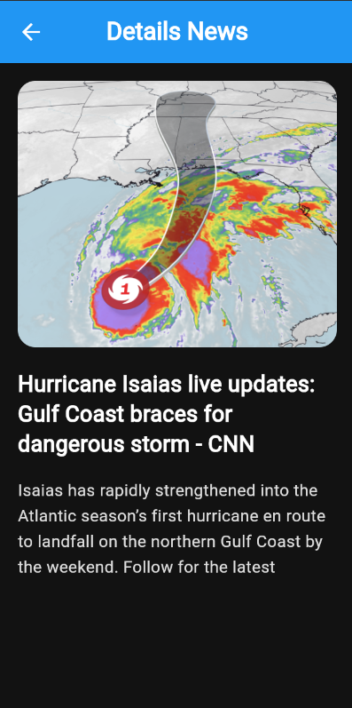

# News App 📰

A clean, modern Flutter News application built as part of the EraaSoft Flutter Course (Day 11 Assignment). This project features real-time news fetching, article listings, and detailed view powered by News API.

## 📱 App Screenshots

| Home Screen | News Details |
| :---: | :---: |
|  |  |

## ✨ Features

- **News Articles List**: Fetch and view real-time top headlines and news articles.
- **Detailed Article View**: Tap on any news card to navigate to a dedicated screen with the full article image, title, and description.
- **API Integration**: Real-time HTTP requests to News API using the `http` package.
- **Custom UI Design**: Dark theme interface with rounded news cards, custom AppBars, and smooth image loading states.

## 📁 Project Structure

```
lib/
├── core/
│   ├── app_dialog/
│   │   └── app_dialog.dart
│   └── app_routes/
│       └── app_routes.dart
└── features/
    ├── data/
    │   ├── models/
    │   │   └── news_model.dart
    │   └── services/
    │       └── news_api.dart
    └── views/
        ├── screens/
        │   ├── detail_screen.dart
        │   └── home_screen.dart
        └── widgets/
            └── card.dart
```

## 🚀 Getting Started

### Prerequisites
- [Flutter SDK](https://docs.flutter.dev/get-started/install) (v3.13 or newer)
- Android Studio / VS Code
- News API Key Configured

### Installation
1. Clone the repository:
   ```bash
   git clone git@github.com:MichealHakeem2/day11_assignment.git
   ```
2. Navigate to the project directory:
   ```bash
   cd day11
   ```
3. Get dependencies:
   ```bash
   flutter pub get
   ```
4. Run the application:
   ```bash
   flutter run
   ```

## 🛠️ Tech Stack & Packages

- **Framework**: Flutter
- **Language**: Dart
- **Networking**: [HTTP](https://pub.dev/packages/http)
- **API Provider**: [News API](https://newsapi.org/)
- **Icons**: [Cupertino Icons](https://pub.dev/packages/cupertino_icons)
